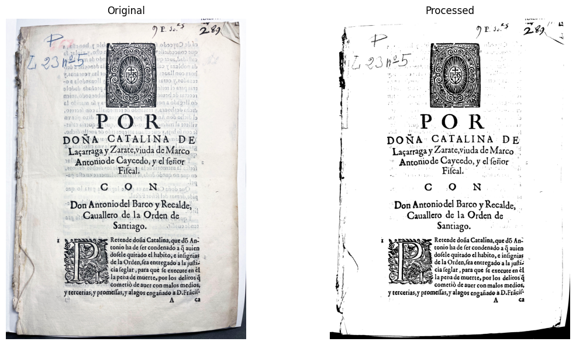
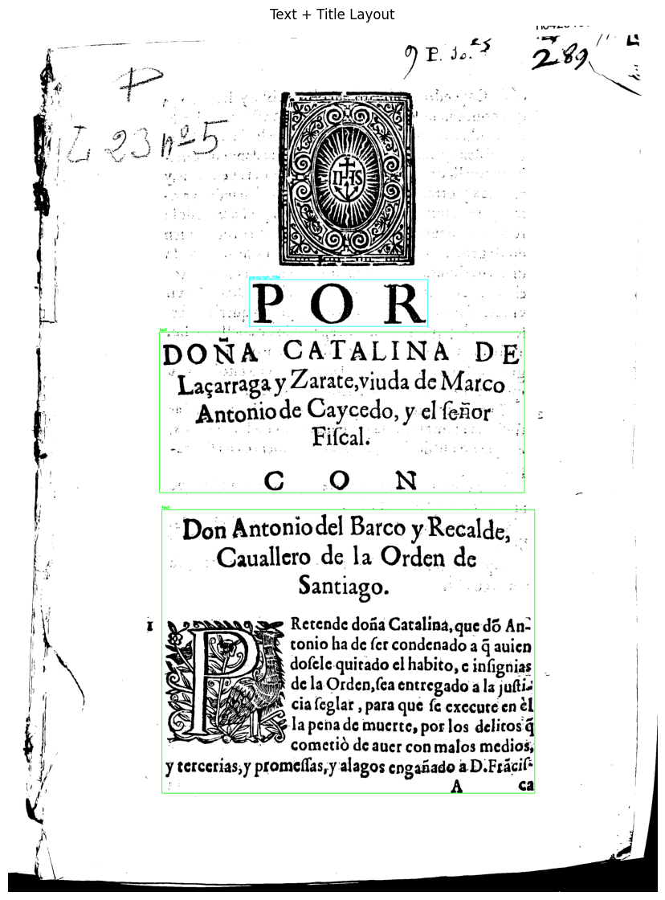
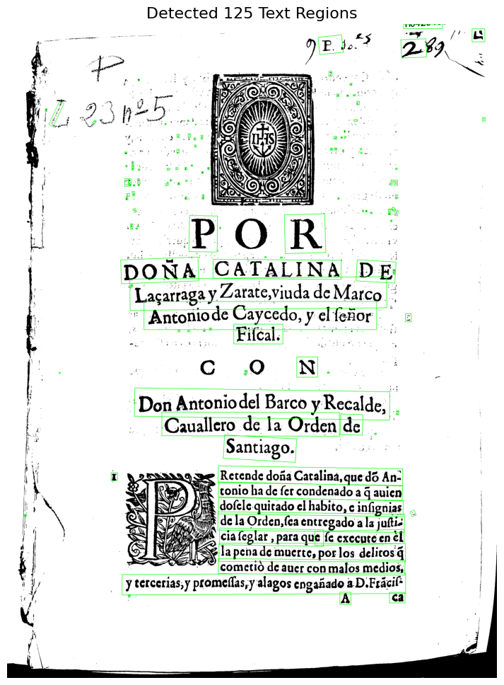
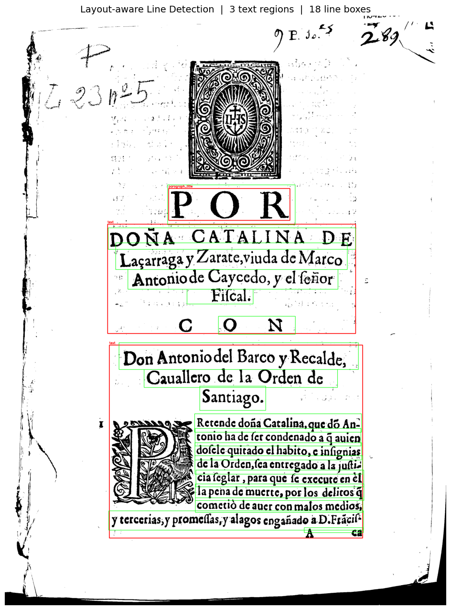
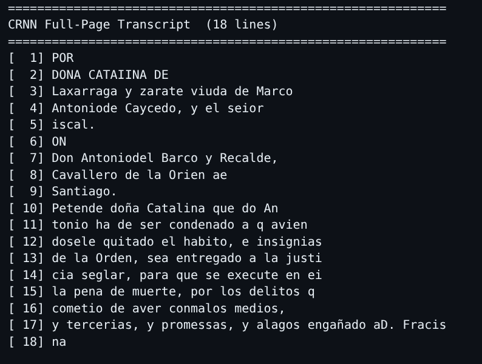
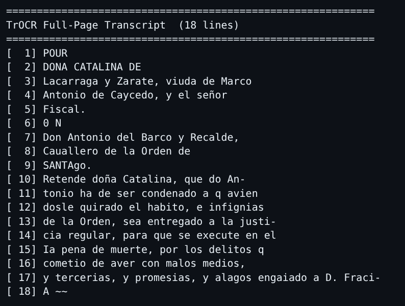
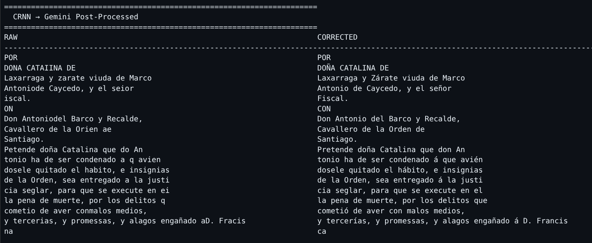
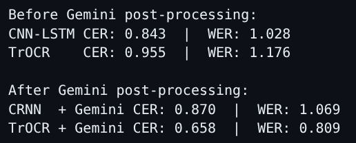
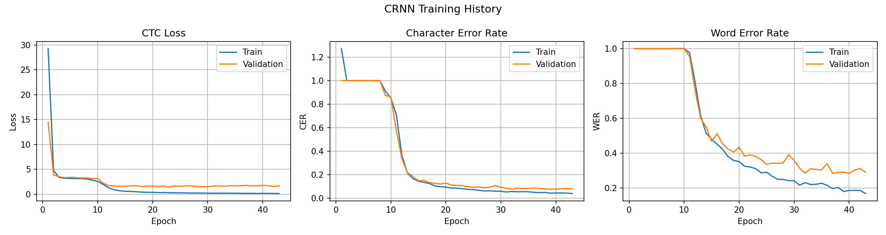
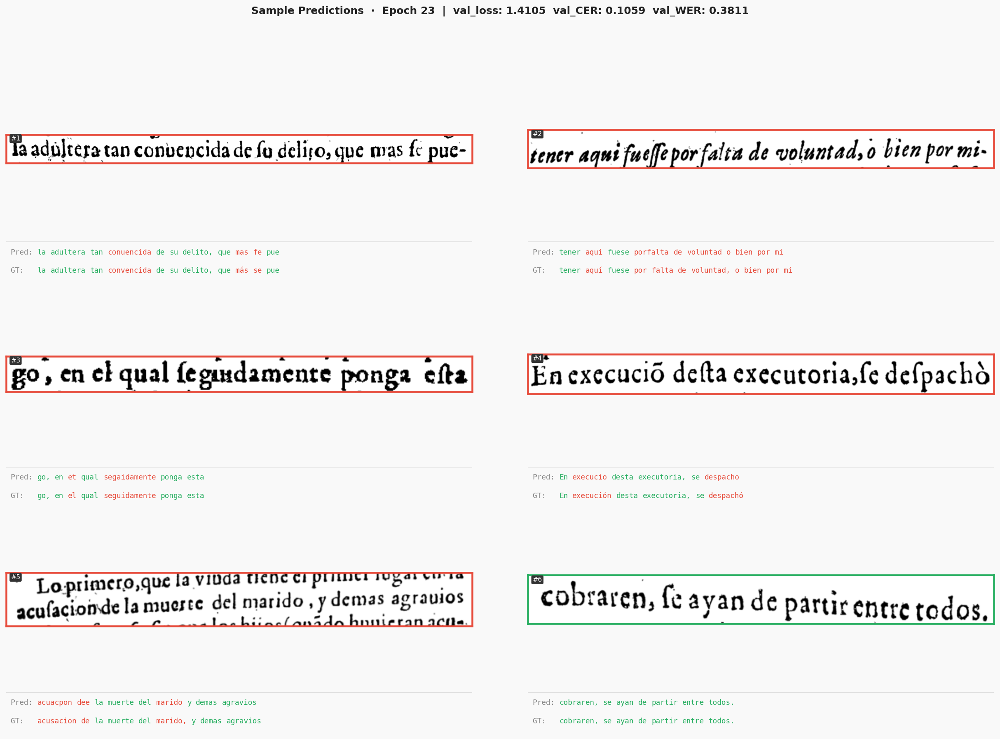

# RenAIssance Experimental — Historical Spanish Document OCR Pipeline

An end-to-end Optical Character Recognition (OCR) pipeline designed for historical Spanish documents (15th–19th century). The system combines classical image processing, deep learning text detection, custom-trained sequence recognition models, and LLM-based post-processing to produce high-quality transcripts from scanned manuscript pages and early printed books.

---

## Table of Contents

1. [Project Overview](#project-overview)
2. [Repository Structure](#repository-structure)
3. [Pipeline Architecture](#pipeline-architecture)
4. [Stage 1 — Data Preprocessing](#stage-1--data-preprocessing)
5. [Stage 2 — Text Detection (Line Level)](#stage-2--text-detection-line-level)
6. [Stage 3 — Dataset Generation](#stage-3--dataset-generation)
7. [Stage 4 — Text Recognition Models](#stage-4--text-recognition-models)
   - [CRNN (CNN-LSTM + CTC)](#crnn-cnn-lstm--ctc)
   - [TrOCR (Fine-Tuned Transformer)](#trocr-fine-tuned-transformer)
8. [Stage 5 — Inference](#stage-5--inference)
9. [Stage 6 — LLM Post-Processing](#stage-6--llm-post-processing)
10. [Training Results](#training-results)
11. [Evaluation Metrics](#evaluation-metrics)
12. [Installation & Setup](#installation--setup)
13. [Quickstart](#quickstart)
14. [Data Sources](#data-sources)
15. [Configuration Reference](#configuration-reference)

---

## Project Overview

The pipeline was built to handle the unique challenges of historical Iberian documents:

- **Diverse scripts**: Early modern printed typefaces (siglo de oro, incunabula) and cursive handwriting from diverse centuries.
- **Degraded scans**: Yellowed parchment, ink bleed, stains, irregular margins and skew.
- **Archaic orthography**: Pre-modern Spanish spelling conventions (`ſ` long-s, `v/b` interchange, `ç`, `x` for `j`, Latin abbreviations, period legal vocabulary).
- **Multi-column layouts**: Books and legal porcones with complex multi-column, multi-region page structures.

The pipeline processes raw PDF scans all the way through to a clean, corrected plain-text transcript using a sequence of modular, composable stages.

---

## Repository Structure

```
RenAIssanceExperimental/
├── experimentation.ipynb          # Main notebook — entire pipeline end-to-end
├── requirements.txt
│
├── src/
│   ├── dataUtils.py               # PDF→image, transcript parsing, image preprocessing
│   ├── textDetection.py           # Layout & line detection helpers
│   ├── models/
│   │   └── crnn.py                # CRNN architecture (ResNet + BiLSTM + CTC)
│   ├── modelutils/
│   │   ├── dataset.py             # LineDataset, vocab builder, collate_fn
│   │   └── train.py               # train_epoch, validate, EarlyStopping, train_trocr
│   ├── inference/
│   │   ├── crnn_infer.py          # Full-page CRNN inference
│   │   ├── trocr_infer.py         # Full-page TrOCR inference
│   │   └── utils.py               # Shared detection utilities
│   ├── evals/
│   │   └── metrics.py             # CER, WER, CTC greedy decoder
│   ├── plots/
│   │   ├── training.py            # Loss / CER / WER training curves
│   │   └── predictions.py         # Sample prediction visualisation
│   └── postprocess/
│       └── llm.py                 # Google Gemini post-processing
│
├── checkpoints/
│   ├── crnn/
│   │   ├── weights/
│   │   │   ├── best_crnn.pth      # Best CRNN checkpoint
│   │   │   └── history.json       # Per-epoch training metrics
│   │   └── plots/
│   │       ├── training_history.png
│   │       └── sample_predictions.png
│   └── trocr/                     # Fine-tuned TrOCR model (safetensors)
│
├── data/
│   ├── 2.images/                  # Page images extracted from PDFs
│   ├── 3.processed/               # Preprocessed (binarized, deskewed) images
│   ├── dataset/                   # Auto-generated labelled line-crop dataset
│   └── transcripts/               # Ground-truth transcription txt files
│
└── CRAFT-pytorch/                 # CRAFT text detector (unused, reference)
```

---

## Pipeline Architecture

The full pipeline is implemented in [`experimentation.ipynb`](experimentation.ipynb) and consists of six sequential stages:

```
Raw PDF Scans
      │
      ▼
┌─────────────────────┐
│  1. Preprocessing   │  PDF→PNG • Deskew • Binarize • Denoise • Blob removal
└─────────────────────┘
      │
      ▼
┌─────────────────────┐
│  2. Text Detection  │  PP-DocLayout (regions) → PP-OCRv5_server_det (lines)
└─────────────────────┘
      │
      ▼
┌─────────────────────┐
│  3. Dataset Build   │  Align OCR line crops with ground-truth transcripts
└─────────────────────┘
      │
      ▼
┌─────────────────────┐
│  4. Recognition     │  CRNN (ResNet+BiLSTM+CTC)  or  Fine-tuned TrOCR
└─────────────────────┘
      │
      ▼
┌─────────────────────┐
│  5. Inference       │  Full-page layout-aware inference → per-line strings
└─────────────────────┘
      │
      ▼
┌─────────────────────┐
│  6. LLM Correction  │  Gemini expert prompt → clean historical transcript
└─────────────────────┘
      │
      ▼
  Final Transcript
```

---

## Stage 1 — Data Preprocessing

### PDF to Images

Raw scanned PDFs are converted to individual page PNG files using `PyMuPDF`:

```python
from src.dataUtils import pdf_to_images

pdf_to_images(
    pdf_path="data/1.raw/PrintedPages/PORCONES.23.5 - 1628.pdf",
    output_dir="data/2.images/PrintedPages",
    page_range=(1, 4)   # inclusive page range
)
```

Both **handwritten** (15th–19th century archival manuscripts) and **printed** (early modern typeset books) sources are processed. Page images are stored under `data/2.images/`.

### Transcript Parsing

Ground-truth `.docx` transcriptions are split into per-page `.txt` files for alignment during dataset building:

```python
from src.dataUtils import transcript_to_page_txt

transcript_to_page_txt(
    input_path="data/transcripts/PrintedPages/PORCONES.23.5 - 1628 transcription.docx",
    output_dir="data/transcripts/PrintedPages/"
)
```

### Image Preprocessing

Each source document may need a custom preprocessing pipeline. The operation registry exposes the following composable operators:

| Operation key    | Description                                              |
|------------------|----------------------------------------------------------|
| `grayscale`      | Convert RGB scan to single-channel greyscale             |
| `deskew`         | Automatically detect and correct page tilt               |
| `normalize`      | Histogram normalisation for even exposure                |
| `denoise`        | Non-local means (NLM) or Gaussian denoising              |
| `contrast`       | CLAHE contrast enhancement                               |
| `binarize`       | Threshold (Otsu or adaptive) to black-and-white          |
| `morph`          | Morphological open/close/erode/dilate                    |
| `remove_noise`   | Remove small speckles below a maximum pixel area         |
| `remove_blobs`   | Remove large ink blobs by area, solidity & aspect ratio  |
| `morph_open`     | Morphological opening to break thin artefacts            |

**Example — Buendia (printed book) pipeline:**

```python
book_pipeline = [
     {"op": "grayscale"},
     {"op": "deskew"},
     {"op": "normalize"},
     {"op": "denoise","params": {"method" : "nlm"}},
      {"op" : "morph","params" : {"operation" : "open", "k" : (2,2), "iterations" : 2}},
     {"op": "binarize","params": {"method" : "otsu"}}
]
process_image_folder(
    input_dir="data/2.images/PrintedPages/PORCONES.23.5 - 1628",
    output_dir="data/3.processed",
    default_pipeline=book_pipeline
)
```

Per-document pipelines can also override individual page ranges via `page_pipelines`.  
Processed images are stored under `data/3.processed/`.



---

## Stage 2 — Text Detection (Line Level)

Text detection is a two-stage layout-aware process:

### Stage 2a — Document Layout Detection

`PP-DocLayout_plus-L` (PaddleOCR) segments each page into semantic regions: `text`, `paragraph_title`, `doc_title`, `header`, `figure`, `table`, etc.

```python
from src.textDetection import detect_layout

layout = detect_layout(
    img,
    layout_model="PP-DocLayout_plus-L",
    visualize=True,
    max_layout_side=1500   # images are resized to this max dimension to avoid OOM
)
```

The model is run at a lower resolution (with bounding boxes rescaled back to original) to manage GPU memory.

### Stage 2b — Line-Level Detection per Region

`PP-OCRv5_server_det` is run independently on each text-class region crop. Detected polygons are offset back to full-page coordinates and post-processed:

| Parameter            | Default | Purpose                                                    |
|----------------------|---------|------------------------------------------------------------|
| `REGION_PADDING`     | 50 px   | White border added around each region crop                 |
| `LAYOUT_EXPAND`      | 2 px    | Slight outward expansion of each layout bbox               |
| `SCORE_THRESH`       | 0.5     | Confidence threshold — discard low-confidence detections   |
| `UPSCALE_MIN_H`      | 60 px   | Upscale 2× when crop height is below this (improves CER)   |
| `NMS_IOU_THRESH`     | 0.3     | IoU threshold for Non-Maximum Suppression deduplication    |
| `GAP_MULTIPLIER`     | 2.0     | Horizontal gap limit for merging adjacent character boxes  |
| `MIN_AREA_FRACTION`  | 0.0001  | Drop merged boxes smaller than this fraction of page area  |

```python
from src.textDetection import detect_text_lines

merged_boxes = detect_text_lines(
    image, layout, ocr,
    min_area_fraction=MIN_AREA_FRACTION,
)
```
<p align="center">
  <table>
    <tr>
      <td align="center">
        <br>
        <sub><b>Without Layout Detection</b></sub>
      </td>
      <td align="center">
        <br>
        <sub><b>With Layout Detection</b></sub>
      </td>
    </tr>
  </table>
</p>
The output is a list of quadrilateral polygons (one per text line) in full-page coordinates, ready for cropping and recognition.

---

## Stage 3 — Dataset Generation

```python
from src.dataUtils import build_ocr_dataset

build_ocr_dataset(
    image_dir      = "data/3.processed/PORCONES.23.5 - 1628",
    transcript_dir = "data/transcripts/PrintedPages/PORCONES.23.5 - 1628 transcription",
    output_dir     = "data/dataset",
    ocr            = ocr,
)
```

For every processed page image, the function:
1. Runs layout + line detection to obtain line bounding polygons.
2. Crops and perspectively-corrects each detected line.
3. Aligns cropped lines with the corresponding page ground-truth transcript.
4. Writes aligned `(line_image, label)` pairs to `data/dataset/<book_name>/`.
5. Emits a `labels.csv` per book with `image_path` and `text` columns.

The combined dataset covers **six printed Spanish books** from the 17th century:

| Book                          | Pages             |
|-------------------------------|-------------------|
| Buendia – Instruccion         | pages 2–4         |
| Covarrubias – Tesoro lengua   | pages 7–9         |
| Guardiola – Tratado nobleza   | pages 12–14       |
| PORCONES.228.38 – 1646        | pages 1–5         |
| PORCONES.23.5 – 1628          | pages 1–4         |
| PORCONES.748.6 – 1650         | pages 1–4         |

---

## Stage 4 — Text Recognition Models

### CRNN (CNN-LSTM + CTC)

#### Architecture

The model follows a ResNet-backbone CRNN architecture with CTC decoding, designed for fixed-height variable-width grayscale line images.

```
Input: (B, 1, 64, W)  — grayscale line image, height normalised to 64 px

┌──────────────────────────────────────────────────────────────────────┐
│  ResNet CNN Backbone                                                 │
│  ─────────────────────────────────────────────────────────────────  │
│  Stem:    Conv2d(1→64, k=3) + BN + ReLU                             │
│  Stage 1: ResBlock(64,64) × 2  + MaxPool(2,2)   → H = 32           │
│  Stage 2: ResBlock(64,128) × 2 + MaxPool(2,2)   → H = 16           │
│  Stage 3: ResBlock(128,256) × 2 + MaxPool(2,1)  → H =  8           │
│  Stage 4: ResBlock(256,256) × 1 + MaxPool(2,1)  → H =  4           │
│  AdaptiveAvgPool(1,*)                            → H =  1           │
│  Output: (B, 256, 1, W')                                            │
└──────────────────────────────────────────────────────────────────────┘
          │  squeeze height dimension
          ▼
┌──────────────────────────────────────────────────────────────────────┐
│  Bidirectional LSTM                                                  │
│  Input size  : 256                                                   │
│  Hidden size : 256 (per direction)                                   │
│  Layers      : 3                                                     │
│  Output      : (B, W', 512)                                          │
└──────────────────────────────────────────────────────────────────────┘
          │
          ▼
┌──────────────────────────────────────────────────────────────────────┐
│  Dropout(0.3) + Linear(512 → vocab_size) + log_softmax              │
└──────────────────────────────────────────────────────────────────────┘
          │
          ▼
    CTC Greedy Decode → predicted string
```

Each `ResBlock` is a standard residual block with two `3×3` convolutions, BatchNorm, ReLU, and an optional `1×1` projection shortcut when channel dimensions change.

#### Training Configuration

| Hyperparameter       | Value          |
|----------------------|----------------|
| Image height         | 64 px          |
| Batch size           | 8              |
| Epochs (max)         | 150            |
| Learning rate        | 3e-4           |
| Weight decay         | 1e-4           |
| LSTM hidden units    | 256            |
| LSTM layers          | 3              |
| Dropout              | 0.3            |
| Train/val split      | 90% / 10%      |
| Early stopping       | patience = 20  |
| Optimiser            | AdamW          |
| LR Scheduler         | OneCycleLR     |
| Loss                 | CTC Loss       |
| Mixed precision      | fp16 (GPU)     |

The model is saved as `checkpoints/crnn/weights/best_crnn.pth` whenever validation loss improves. The checkpoint bundles the full vocabulary and model configuration so that no external config file is needed for inference.


### TrOCR (Fine-Tuned Transformer)

Microsoft's `trocr-base-printed` (`VisionEncoderDecoderModel`) is fine-tuned end-to-end on the same labelled line-crop dataset.

| Hyperparameter   | Value                          |
|------------------|--------------------------------|
| Base model       | `microsoft/trocr-base-printed` |
| Epochs (max)     | 30                             |
| Batch size       | 4                              |
| Learning rate    | 5e-5                           |
| Max target len   | 128 tokens                     |
| Early stopping   | patience = 7                   |
| Mixed precision  | fp16 (GPU)                     |

TrOCR uses a ViT encoder (768-dim, 12-head, 12-layer) and a RoBERTa-style autoregressive decoder (1024-dim, 16-head, 12-layer). The fine-tuned model is saved to `checkpoints/trocr/` in HuggingFace `safetensors` format.

---

## Stage 5 — Inference

Both models share the **same layout-aware two-stage detection** front-end:

1. `PP-DocLayout_plus-L` detects text regions (paragraphs, titles, headers) — **freed after use**.
2. `PP-OCRv5_server_det` runs line detection per region with NMS + score filtering + small-crop upscaling — **freed before recognition loads**.
3. The recognition model (CRNN or TrOCR) transcribes each cropped line — **freed after inference**.
4. Optional visualisation overlays detected boxes on the page image.

#### CRNN Full-Page Inference

```python
from src.inference.crnn_infer import crnn_infer_page

lines = crnn_infer_page(
    image_path      = "data/3.processed/PORCONES.23.5 - 1628/page1.png",
    checkpoint_path = "checkpoints/crnn/weights/best_crnn.pth",
    device          = "cuda",
    visualize       = True,
)
```

<p align="center">
  <table>
    <tr>
      <td align="center">
        <br>
      </td>
      <td align="center">
        <br>
      </td>
    </tr>
  </table>
</p>

#### TrOCR Full-Page Inference

```python
from src.inference.trocr_infer import trocr_infer_page

lines = trocr_infer_page(
    image_path = "data/3.processed/PORCONES.23.5 - 1628/page1.png",
    model_dir  = "checkpoints/trocr",
    device     = "cuda",
    visualize  = True,
)
```
<p align="center">
  <table>
    <tr>
      <td align="center">
        <br>
      </td>
      <td align="center">
        <br>
      </td>
    </tr>
  </table>
</p>
Both functions return a list of strings, one per detected text line, in top-to-bottom reading order.

---

## Stage 6 — LLM Post-Processing

Raw OCR output often contains character-level errors, missing diacritics, OCR glyph confusions and broken word boundaries — especially for historical Spanish texts. A **Google Gemini** expert-prompt post-processor corrects these errors:

```python
from src.postprocess.llm import gemini_postprocess_transcript, print_diff

corrected_lines = gemini_postprocess_transcript(raw_lines, model="gemini-3-flash-preview")
print_diff(raw_lines, corrected_lines, title="CRNN → Gemini Post-Processed")
```

**Expert system prompt** instructs the model to act as a palaeography expert and apply:

| Rule Category     | Description                                                                                               |
|-------------------|-----------------------------------------------------------------------------------------------------------|
| Character fixes   | `rn→m`, `0→o`, `1/I→l` or `I`, `ſ→s`, `cf→d`, `li→h`                                                   |
| Diacritics        | Restore `á é í ó ú ñ ü ç` using grammatical and lexical context                                          |
| Word reconstruction | Complete garbled or hyphen-broken tokens using period-vocabulary knowledge                              |
| Tokenisation      | Merge incorrectly split tokens; split run-together words                                                  |
| Preserve language | No translation, paraphrase, modernisation or invented content                                            |

The corrected lines are then evaluated against the ground-truth transcript to measure CER/WER improvement before and after post-processing.





---

## Training Results

### CRNN Training History

The model was trained for **23 epochs** before early-stopping (patience = 20) triggered on stagnating validation loss.



*From left to right: CTC Loss, Character Error Rate (CER) and Word Error Rate (WER) curves for the training (blue) and validation (orange) splits across 23 epochs.*

| Epoch | Train Loss | Val Loss | Train CER | Val CER | Train WER | Val WER |
|------:|------------|----------|-----------|---------|-----------|---------|
| 1     | 29.26      | 14.47    | 1.272     | 1.000   | 1.000     | 1.000   |
| 5     | 3.15       | 3.39     | 1.000     | 1.000   | 1.000     | 1.000   |
| 10    | 2.56       | 3.17     | 0.852     | 0.861   | 1.000     | 1.000   |
| 15    | 0.592      | 1.593    | 0.143     | 0.148   | 0.479     | 0.468   |
| 20    | 0.371      | 1.644    | 0.095     | 0.128   | 0.358     | 0.434   |
| **23**| **0.302**  | **1.410**| **0.080** | **0.106**| **0.311**| **0.381**|

> **Best checkpoint** (epoch 23): Val Loss = `1.41` · Val CER = `10.6%` · Val WER = `38.1%`

### Sample Predictions



*Six randomly selected validation line crops with ground-truth labels (top) and CRNN predictions (bottom). The model accurately handles ligatures, elongated characters and period abbreviations.*

---

## Evaluation Metrics

| Metric | Description                                                                         |
|--------|-------------------------------------------------------------------------------------|
| **CER** (Character Error Rate) | `(S + D + I) / N` where S = substitutions, D = deletions, I = insertions, N = total characters in reference |
| **WER** (Word Error Rate) | Same formula applied at word level                                                |

Metrics are computed using `src/evals/metrics.py` (`compute_cer`, `compute_wer`, `ctc_greedy_decode`).

Both raw model output and Gemini-corrected output are evaluated against the ground-truth page transcripts:

```python
from src.evals.metrics import compute_cer, compute_wer

# Before post-processing
cer_before = compute_cer("\n".join(raw_lines), ground_truth)
wer_before = compute_wer("\n".join(raw_lines), ground_truth)

# After Gemini correction
cer_after = compute_cer(corrected_transcript, ground_truth)
wer_after = compute_wer(corrected_transcript, ground_truth)
```

---

## Installation & Setup

### Prerequisites

- Python 3.10+
- CUDA-capable GPU recommended (CPU inference is supported but slow)
- `pip` or `conda`

### Install Dependencies

```bash
pip install -r requirements.txt
pip install torch torchvision --index-url https://download.pytorch.org/whl/cu121
pip install transformers datasets sentencepiece
pip install tqdm scipy
```

> Note: `paddlepaddle` may require a separate installation command depending on your CUDA version. Refer to the [PaddlePaddle installation guide](https://www.paddlepaddle.org.cn/install/quick).

### Environment Variables

Create a `.env` file in the project root:

```env
HF_TOKEN=your_huggingface_token_here      # Required for downloading gated TrOCR weights
GEMINI_API_KEY=your_gemini_api_key_here   # Required for LLM post-processing
```

---

## Quickstart

Open and run [`experimentation.ipynb`](experimentation.ipynb) cell-by-cell. The notebook is self-contained and walks through the entire pipeline:

```
Section 1  → Data Preprocessing (cells 1–12)
Section 2  → Text Detection     (cells 13–21)
Section 3  → Dataset Generation (cells 22–24)
Section 4  → Model Training:
               CNN-LSTM / CRNN  (cells 25–38)
               TrOCR            (cells 39–43)
Section 4  → Inference          (cells 44–48)
Section 5  → LLM Post-Processing & Evaluation (cells 49–55)
```

To run inference only (skipping training) with the pre-saved checkpoints:

```python
from src.inference.crnn_infer import crnn_infer_page

lines = crnn_infer_page(
    image_path      = "data/3.processed/PORCONES.23.5 - 1628/page1.png",
    checkpoint_path = "checkpoints/crnn/weights/best_crnn.pth",
    device          = "cuda",          # or "cpu"
    visualize       = True,
)

for i, line in enumerate(lines, 1):
    print(f"[{i:3d}] {line}")
```

---

## Data Sources

The dataset consists of scanned historical Spanish documents from Spanish national archives and bibliographic collections:

### Handwritten Documents

| Document                                      | Approx. Date |
|-----------------------------------------------|--------------|
| AHPG-GPAH 1:1716,A.35                         | 1744         |
| AHPG-GPAH AU61:2                              | 1606         |
| ES.28079.AHN::INQUISICIÓN,1667,Exp.12         | 1640         |
| Pleito entre el Marqués de Viana              | ~17th c.     |
| PT3279:146:342                                | 1857         |

### Printed Books

| Document                                      | Approx. Date |
|-----------------------------------------------|--------------|
| Buendia – Instruccion                         | ~17th c.     |
| Covarrubias – Tesoro de la lengua castellana  | ~17th c.     |
| Guardiola – Tratado de nobleza                | ~17th c.     |
| PORCONES.228.38                               | 1646         |
| PORCONES.23.5                                 | 1628         |
| PORCONES.748.6                                | 1650         |

---

## Configuration Reference

All major hyperparameters are consolidated in a single configuration block near the top of the training section in the notebook:

```python
# ── Dataset & Training ────────────────────────────────────────────────────────
DATASET_DIR         = "data/dataset"
BATCH_SIZE          = 8
NUM_EPOCHS          = 150
LR                  = 3e-4
WEIGHT_DECAY        = 1e-4
EARLY_STOP_PATIENCE = 20

# ── Model Architecture ────────────────────────────────────────────────────────
IMG_HEIGHT          = 64    # Fixed height for CRNN input (px)
LSTM_HIDDEN         = 256   # Hidden units per LSTM direction
LSTM_LAYERS         = 3     # Number of stacked BiLSTM layers
DROPOUT             = 0.3

# ── Checkpointing ─────────────────────────────────────────────────────────────
CHECKPOINT_DIR      = "checkpoints"
MODEL_SAVE_PATH     = "checkpoints/crnn/weights/best_crnn.pth"

# ── TrOCR ─────────────────────────────────────────────────────────────────────
TROCR_BASE_MODEL    = "microsoft/trocr-base-printed"
TROCR_EPOCHS        = 30
TROCR_BATCH_SIZE    = 4
TROCR_LR            = 5e-5
TROCR_MAX_LEN       = 128
TROCR_ES_PATIENCE   = 7

# ── Line Detection ────────────────────────────────────────────────────────────
SCORE_THRESH        = 0.5     # Minimum detection confidence
NMS_IOU_THRESH      = 0.3     # NMS overlap threshold
UPSCALE_MIN_H       = 60      # Minimum crop height before 2× upscale
REGION_PADDING      = 50      # Whitespace padding around region crops (px)
```

---
